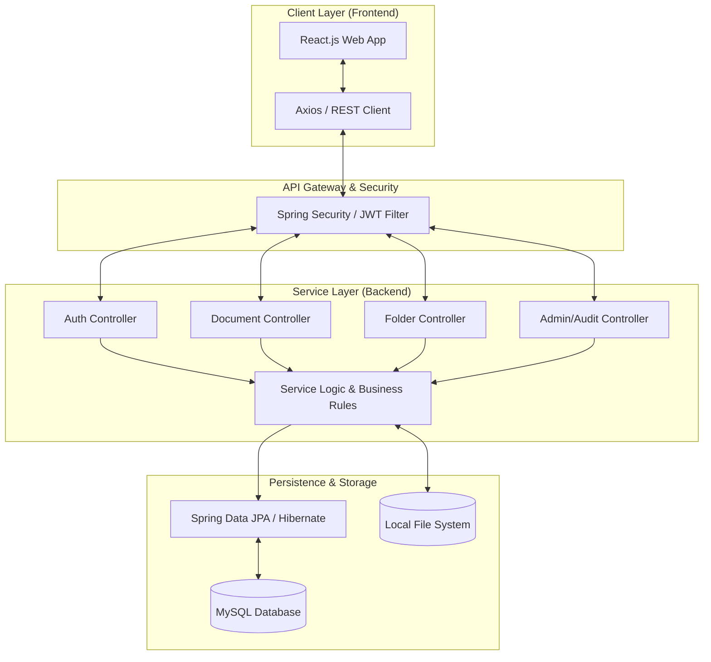
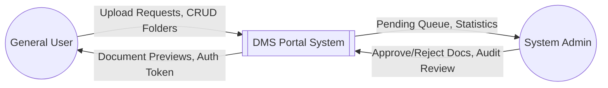
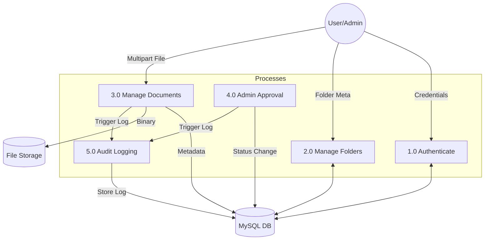
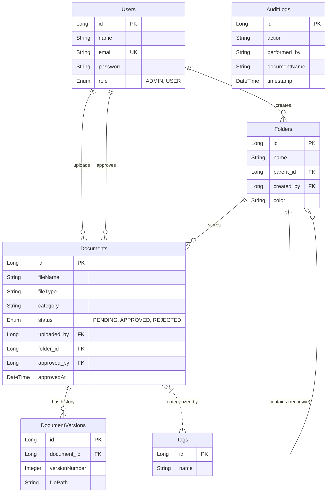
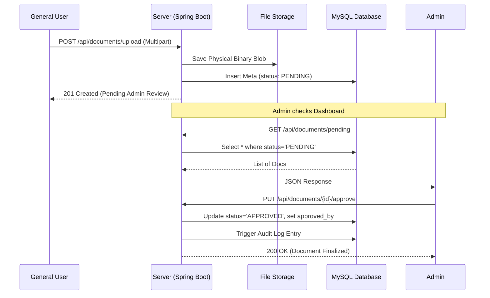

# Comprehensive Project Report: DMS Portal
## (Thesis & Academic Documentation Support)

> **Project Name**: DMS Portal (Document Management System)  
> **Frameworks**: React.js, Spring Boot, MySQL  
> **Prepared for**: Academic Submission / Thesis Presentation  
> **Date**: April 2026

---

## 1. Abstract
The **DMS Portal** is a centralized platform designed for the secure storage, lifecycle management, and systematic approval of digital documents. The system addresses the inefficiencies of traditional file sharing — such as version ambiguity and lack of traceability — by implementing automated version control, administrative approval workflows, and comprehensive audit logging. Built with a decoupled architecture (React and Spring Boot), it provides a high-performance, scalable solution for enterprise document governance.

---

## 2. Introduction
### 2.1 Problem Statement
In modern organizational environments, document sprawl leads to "Document Chaos," characterized by:
- **Redundancy**: Multiple versions of the same file existing across different silos.
- **Security Risks**: Lack of centralized access control for sensitive files.
- **Audit Gaps**: No record of who accessed or modified specific documents.
- **Workflow Bottlenecks**: Inefficient manual approval processes for finalized documents.

### 2.2 Proposed Solution
The DMS Portal provides a structured environment with the following key pillars:
- **Hierarchical Organization**: Recursive folder structures with color-coding.
- **Collaborative Review**: Any user-uploaded document must be approved by an administrator before becoming "Final."
- **Immutable Audit Trails**: Every state change (Update, Delete, Approval) is logged for compliance.
- **Smart Versioning**: Automatic preservation of legacy file versions during updates.

---

## 3. System Architecture
The system follows a **Three-Tier Architecture** model, ensuring separation of concerns between presentation, logic, and data.



---

## 4. Data Flow Diagrams (DFD)

### 4.1 DFD Level 0: Context Diagram
Visualizes the system boundaries and external entities.



### 4.2 DFD Level 1: Functional Decomposition
Decomposes the system into functional processes and data stores.



---

## 5. Entity-Relationship Diagram (ERD)
The database schema is designed for relational consistency and auditability.



---

## 6. Use Case Diagram
Defining boundaries and user interactions.

```mermaid
graph TD
    User((General User))
    Admin((System Admin))

    subgraph "DMS Portal System"
        UC1[Login / Authentication]
        UC2[Create & Organize Folders]
        UC3[Upload Documents]
        UC4[View Document Versions]
        UC5[Review & Approve Uploads]
        UC6[Monitor Audit Logs]
        UC7[Delete Records]
    end

    User --> UC1
    User --> UC2
    User --> UC3
    User --> UC4

    Admin --> UC1
    Admin --> UC5
    Admin --> UC6
    Admin --> UC7
    Admin --|> User
```

---

## 7. Behavioral Analysis: Document Approval Flow
The following sequence diagram illustrates the lifecycle of a document from user upload to administrative finalization.



---

## 8. Technical Implementation Details

### 8.1 Modern Technology Stack
- **Frontend Layer**: Built with **React.js (v18)** using functional components and Hooks. State management is handled via React Context API (AuthContext).
- **Security Layer**: Stateless authentication using **JWT (JSON Web Tokens)**. Every request is intercepted by a `JwtAuthenticationFilter` to ensure validity.
- **Backend Layer**: **Spring Boot (v3.4)** provides robust REST endpoints. Exception handling is centralized using `@ControllerAdvice`.
- **Database Layer**: **MySQL** stores metadata with **JPA/Hibernate** mapping Java entities to relational tables.

### 8.2 Project Structure Analysis
```text
dishuproject/
├── backend/                  # Java Spring Boot Service
│   └── src/main/java/com/dms/backend/
│       ├── config/           # Security & App Configuration
│       ├── controller/       # Rest API Endpoints
│       ├── entity/           # Database Domain Models
│       ├── repository/       # Data Access Layer (JPA)
│       └── service/          # Core Business Logic
└── frontend/                 # React UI Application
    └── src/
        ├── components/       # Reusable UI Elements (Navbar, Modals)
        ├── pages/            # View Layers (Dashboard, Folder View)
        ├── services/         # Axios API Interaction Logic
        └── context/          # Global State (Auth, Alerts)
```

---

## 9. Conclusion
The **DMS Portal** represents a robust implementation of modern software engineering principles. By leveraging a high-performance tech stack and rigorous data flow logic, it ensures that organizational documents are not just stored, but governed. The system's ability to track changes via versioning and monitor actions via audit logs makes it a production-ready solution for academic and professional use cases.
